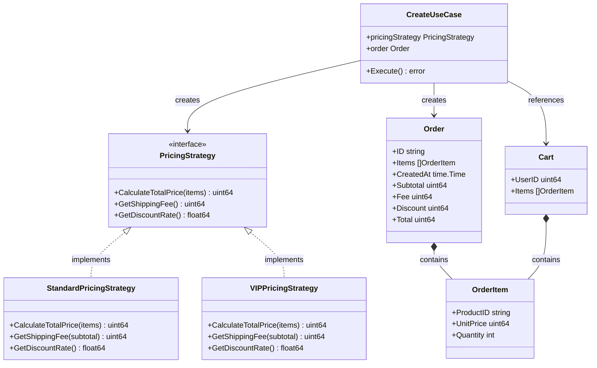

この記事は[前回](https://zenn.dev/frontendflat/articles/c58898a2979464)に引き続き、[Java 言語で学ぶデザインパターン](https://www.hyuki.com/dp/)で学んだ内容のアウトプットです。Web APIの開発を例として、Strategy パターンを用いて「コンテキストに応じたドメイン知識の切り替え」を実装してみます。

## Strategy パターンとは？

Strategy パターンは、**問題の解き方 (アルゴリズム)をまるっと切り替え可能にする**デザインパターンです。インターフェースを用いた処理の委譲 (Delegation) を前提としているため、切り替え自体が容易になり、以下のようなメリットを得られます。

- 実行時にアルゴリズムを切り替えることができる
- 新しいアルゴリズムを追加する際に、既存のアルゴリズムを修正する必要がない

Strategy パターンでは、次のような登場人物が出てきます。

- **Context (文脈)**: ストラテジーを利用する
- **Strategy (戦略)**: アルゴリズムを利用するためのインターフェースを定める
- **ConcreteStrategy (具体的な戦略)**: ストラテジーのインターフェースを実装する

## 具体例: ECサイトの注文API

ここではECサイトの注文APIを例として、Strategy パターンの活用方法を考えます。
会員種別により、割引率と送料の有無が変わるとしましょう。これらのアルゴリズムは、ドメイン知識のStrategyとして表現できます。

- 一般会員: 支払い金額 = 商品合計 * (1 - 0.05) + 送料
- VIP会員: 支払い金額 = 商品合計 * (1 - 0.15)

※ 簡単のため税額は省略します。

### クラス図

サンプルコードとして、レイヤードアーキテクチャを採用したGoのバックエンドを取り上げます。この記事で紹介する内容は、ユースケース層〜ドメイン層の話が中心になります。



### ドメイン層の実装

まずは、Strategyと注文モデルを定義するドメイン層を見ていきます。`interface` で支払い金額の算出に必要なメソッドの集まりを定義します。

```go:/internal/domain/model/order.go
package model

// 支払い金額を算出するためのStrategy
type PricingStrategy interface {
	// 商品合計を計算
	CalculateTotalPrice(items []OrderItem) (uint64, error)
	// 送料を取得
	GetShippingFee(subtotal uint64) uint64
	// 割引率を取得
	GetDiscountRate() float64
}
```

続いて、インターフェースを満たす構造体とメソッドを定義します。 `ConcreteStrategy` であるこれらのStrategyは、一般会員とVIP会員ごとに具体的な算出方法を実装します。

```go:/internal/domain/model/order.go
// 商品合計の計算ロジック (共通)
func CalculateTotalPrice(items []OrderItem) (uint64, error) {
	var total uint64
	for _, item := range items {
		total += item.UnitPrice * uint64(item.Quantity)
	}
	return total, nil
}

// 一般会員向けの計算ストラテジー
type StandardPricingStrategy struct{}

func (s *StandardPricingStrategy) CalculateTotalPrice(items []OrderItem) (uint64, error) {
    return CalculateTotalPrice(items)
}

func (s *StandardPricingStrategy) CalculateShippingFee(subtotal uint64) uint64 {
	return 500 // 一般会員は送料500円
}

func (s *StandardPricingStrategy) GetDiscountRate() float64 {
	return 0.05 // 一般会員は5%割引
}

// VIP会員向けのストラテジー
type VIPPricingStrategy struct{}

func (s *VIPPricingStrategy) CalculateTotalPrice(items []OrderItem) (uint64, error) {
    return CalculateTotalPrice(items)
}

func (s *VIPPricingStrategy) CalculateShippingFee(subtotal uint64) uint64 {
	return 0 // VIP会員は送料無料
}

func (s *VIPPricingStrategy) GetDiscountRate() float64 {
	return 0.15 // VIP会員は15%割引
}
```

これらのストラテジーが会員種別によって振り分けられます。
将来的に異なるルールを適用したい会員が追加されたとしても、Strategyの追加とswitch文の分岐が増えるだけなので変更を局所的なものにできます。

```go:/internal/domain/model/order.go
// 会員種別に応じて、支払い金額の計算ストラテジーを取得する関数
func GetPricingStrategy(accountType string) (PricingStrategy, error) {
	switch accountType {
	case AccountTypeStandard:
		return &StandardPricingStrategy{}, nil
	}
	case AccountTypeVIP:
		return &PremiumPricingStrategy{}, nil
    default:
        return nil, errors.New('存在しない会員種別です')
}
```

:::details 会員種別のイメージ
Goでは文字列の型に名前をつけておくと、switch文などで判定に使えます。

```go:/internal/domain/model/user.go
type AccountType string
const (
	AccountTypeStandard AccountType = "STANDARD"
	AccountTypeVIP      AccountType  = "VIP"
)
```
:::

最後に注文モデルのコンストラクタ関数を見ていきましょう。
外部 (今回の例ではユースケース) から注入されたストラテジーを使って、支払い金額を計算します。Goには言語仕様として継承が存在しないため、Strategy パターンのような委譲を使った緩やかな依存をベースに設計すると良さそうです。

```go:/internal/domain/model/order.go
// 注文モデルのコンストラクタ関数
func NewOrder(strategy PricingStrategy, items []OrderItem) (*Order, error) {
	if len(items) == 0 {
		return nil, errors.New("注文には最低1つの商品が必要です")
	}

	subtotal, err := strategy.CalculateTotalPrice(items)
	if err != nil {
		return nil, err
	}

	// 会員種別に応じた変数を取得
	fee := strategy.CalculateShippingFee(subtotal)
	discount := uint64(float64(subtotal) * strategy.GetDiscountRate())

	// 支払い金額を計算
	total := subtotal + fee - discount

	return &Order{
		ID:        uuid.New().String(),
		Items:     items,
		CreatedAt: time.Now(),
		Subtotal:  subtotal,
		Fee:       fee,
		Discount:  discount,
		Total:     total,
	}, nil
}
```

:::details 注文モデルの実装
コンストラクタ関数が返す注文モデルは、以下のように定義されています。

```go:/internal/domain/model/order.go
type OrderItem struct {
	ProductID string
	UnitPrice uint64
	Quantity  int
}

type Order struct {
	ID        string
	Items     []OrderItem
	CreatedAt time.Time
	Subtotal  uint64
	Fee       uint64
	Discount  uint64
	Total     uint64
}
```
:::


### ユースケース層の実装

注文作成のユースケースである `CreateUseCase` 構造体は、`Execute` メソッドで注文の流れ (ワークフロー) を実装しています。

ここでのポイントは会員種別に応じたStrategyを選択して、それを注文のコンストラクタ関数に注入している点です。支払い金額の計算ロジックは注文モデルにカプセル化されているため、ユースケースはコンテキスト (会員種別) を提供するだけで済み、責務の切り分けが行えます。

```go:/internal/usecase/order/create.go
package order

func (u *CreateUseCase) Execute(ctx context.Context, input *CreateInput) (*CreateDTO, error) {
	// 会員情報をDBから取得する
	account, err := u.accountRepository.FindByID(ctx, input.UserID)
	if err != nil {
		return nil, err
	}

	// カート情報を取得
	cart, err := u.cartRepository.FindByUserID(ctx, input.UserID)
	if err != nil {
		return nil, err
	}

	// 会員の種別に応じて、価格計算ストラテジーを決める
	pricingStrategy := model.GetPricingStrategy(account.Type)

	// 注文を作成
	order, err := model.NewOrder(pricingStrategy, cart.Items)
	if err != nil {
		return nil, err
	}

	// 注文を保存
	err = u.orderRepository.Save(ctx, order)
	if err != nil {
		return nil, err
	}
  order, err = u.orderRepository.FindByID(order.ID)

	return &CreateDTO{
		OrderID: order.ID,
	}, nil
}
```

:::details ユースケースの実装
ユースケースでは以下の構造体、インターフェース、関数が実装されています。

```go:/internal/usecase/order/create.go

type CreateInput struct {
	UserID uint64
}

type CreateDTO struct {
	OrderID string
}

type Creator interface {
	Execute(ctx context.Context, input *CreateInput) (*CreateDTO, error)
}

type CreateUseCase struct {
	accountRepository model.AccountRepository
	cartRepository    model.CartRepository
	orderRepository   model.OrderRepository
}

func NewCreateUseCase(
	accountRepository model.AccountRepository,
	cartRepository model.CartRepository,
	orderRepository model.OrderRepository,
) *CreateUseCase {
	return &CreateUseCase{
		accountRepository: accountRepository,
		cartRepository:    cartRepository,
		orderRepository:   orderRepository,
	}
}
```
:::

## おわりに

Strategy パターンを使うことで、コンテキストに応じたアルゴリズムを選択して使い分けることができました。「誰が何を知っているか」を考え抜くことがデザインパターンの肝だと思うので、オブジェクト指向に慣れる意味でもStrategy パターンは学ぶべきよい例だと思います。
