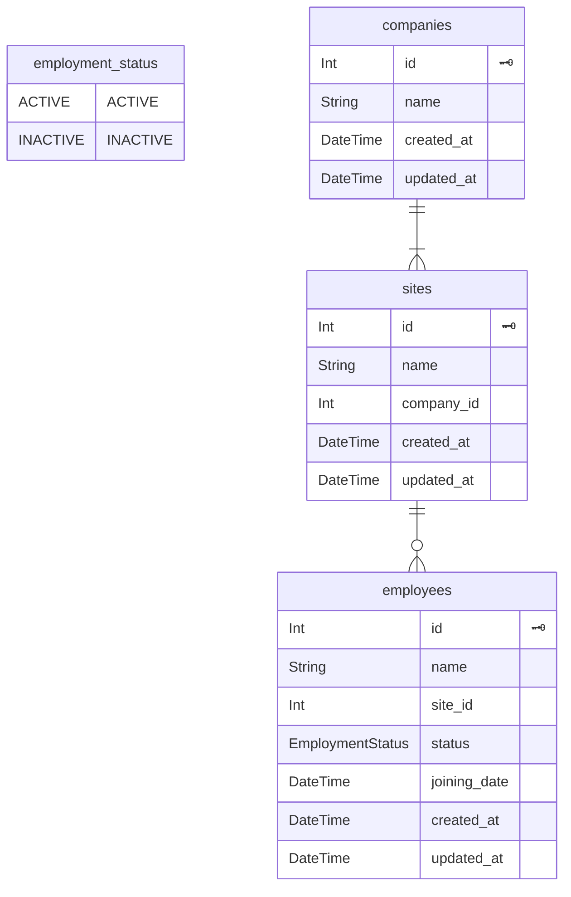

普段はWebフロントエンドのコードを書いています。最近、[Hono](https://hono.dev/)のRPCを使うことでバックエンドとAPIの型を共有できると知り、「開発者体験が大きく向上するのではないか」と興味を持ちました。Full-Stack TypeScriptなプロジェクト構成について考えるよい機会でもあるため、サンプルアプリをつくりながら、記事にまとめようと思います。

## はじめに

バックエンド開発は「TypeScript × ドメイン駆動設計ハンズオン」を参考にさせていただきました。なんか違ったら教えてください。

https://zenn.dev/yamachan0625/books/ddd-hands-on

## ディレクトリ構成

- [pnpm workspace](https://pnpm.io/workspaces)を使ってMonorepoでプロジェクトを管理
- `backend` と `frontend` でディレクトリを切る (共通化できるコードが出てきたら、`shared` に格納する想定)
- 共通パッケージはプロジェクトルートの `package.json` で管理

```
.
├── apps
│   ├── backend
│   │   ├── package.json
│   │   ├── prisma
│   │   │   └── schema.prisma
│   │   ├── src
│   │   │   ├── app.ts
│   │   │   ├── application
│   │   │   │   └── models
│   │   │   │       └── employees
│   │   │   ├── domain
│   │   │   │   └── models
│   │   │   │       └── employees
│   │   │   ├── index.local.ts
│   │   │   ├── index.ts
│   │   │   ├── infrastructure
│   │   │   │   └── prisma
│   │   │   │       └── employees
│   │   │   └── presentation
│   │   │       └── routes
│   │   │           └── employees
│   │   ├── tsconfig.json
│   │   └── vitest.config.ts
│   └── frontend
│       ├── index.html
│       ├── package.json
│       ├── src
│       │   ├── lib
│       │   │   ├── hono
│       │   │   │   └── index.ts
│       │   │   └── react-query
│       │   │       └── index.ts
│       │   ├── main.tsx
│       │   └── models
│       │       └── employees
│       │           ├── components
│       │           └── hooks
│       ├── tsconfig.json
│       └── vite.config.ts
├── package.json
├── pnpm-lock.yaml
└── pnpm-workspace.yaml
```

## ローカル開発環境をつくる

デプロイ先はAWS Lambdaに決めていたのですが、初めはローカル環境の動かし方がわかりませんでした。調べたところ、以下の記事で紹介されている通り、Honoはアダプタを切り替えるだけで様々な環境で動作します。

https://qiita.com/mkin/items/0640030521cc36835f60

これはHonoが[Web APIに準拠している](https://hono.dev/docs/concepts/web-standard)という特徴からきており、ローカル環境はNode.js、本番環境はAWS Lambdaで動かすということが簡単に実現できます。

```ts:/index.local.ts
// ローカル環境向けのNode.jsアダプタ
import { serve } from "@hono/node-server";
import { app } from "./app";

serve({
  fetch: app.fetch,
  port: 3000,
});
```

```ts:/index.ts
// 本番環境向けのAWS Lambda向けアダプタ
import { handle } from "hono/aws-lambda";
import { app } from "./app";

export const handler = handle(app);
```

```ts:/app.ts
// 環境に依存しないアプリケーションのエントリーポイント
const app = new Hono().basePath("/api").use("*", cors());
const routes = app.route("/", employeesRoute);
type AppType = typeof routes;

export { app, type AppType };
```

pnpmではプロジェクトルートからパッケージを操作できるため、以下のコマンドでNode.jsサーバーが3000ポートで起動します。

```bash
pnpm --filter backend dev
```

## バックエンド開発

APIに近いところから、「プレゼンテーション > アプリケーションサービス > リポジトリ > ドメイン」の順で実装していきます。サンプルアプリの題材として、社員情報を照会する機能を扱います。




### プレゼンテーション

まずはAPIのルーティング 〜 リクエストのバリデーション、ハンドリングまでを実装していきます。

`app.ts` はシンプルにしておきたいので、各エンドポイントを `presentation/routes` ディレクトリに配置することにしました。これにより、`app.ts` は各エンドポイントの集約とミドルウェアを呼び出すことだけに集中できます。

```ts:presentation/routes/employees/index.ts
import { Hono } from "hono";
import { z } from "zod";
import { zValidator } from "@hono/zod-validator";

export const employeesRoute = new Hono()
  // GET /api/employees
  .get(
    "/employees",
    // Zod Validator Middlewareでリクエストをバリデーション
    zValidator(
      "query",
      z.object({
        siteId: z.coerce.number().optional(),
        status: z
          .union([z.literal("active"), z.literal("inactive")])
          .optional(),
      }).optional(),
    ),
    // ハンドラはZodのパースが通っている前提で実装できる
    async (context) => {
      const data = context.req.valid("query");
      // 実際の処理はアプリケーションサービスに移譲する
      const service = new GetEmployeesService(new EmployeeRepository());
      const employees = await service.execute(data);

      return context.json(employees, 200);
    }
  );
```

ルートの定義はとてもシンプルで、`new Hono` で生成したインスタンスに `get` や `post` といったHTTPメソッドを生やすだけです。上記の例を見ると、`get` メソッドは次の引数を受け取っています。

- 第1引数: エンドポイントのパス
- 第2引数: Zod Validator Middleware
- 第3引数: HTTP Responseを返すハンドラ

Zod Validator Middlewareを見ていきましょう。第1引数にはバリデーションの対象となるリクエストのボディやクエリパラメータ、パスパラメータなどを指定できます。これらが第2引数で渡したZodスキーマでパースされ、エラーとなった場合は400ステータスコードを含むレスポンスを返します。成功した場合は、第3引数のハンドラが呼ばれます。


*指定できるバリデーションのターゲット*


ちなみに、Zod Validator Middlewareは複数定義できるため、ボディとパスパラメータの両方を検証するといったことができます。

```ts
const app = new Hono()
  .get(
    "/greeting",
    // ボディを検証するvalidator
    zValidator(
      "json",
      z.object({
        message: z.string().max(255),
      })
    ),
    // パスパラメータを検証するvalidator
    zValidator(
      "param",
      z.object({
        id: z.coerce.number(),
      })
    ),
```

:::details APIのテスト

`app.request` を使うことで、簡単にリクエストをシミュレーションできます。あとは、依存しているリポジトリをモックしてあげて、バリデーションを含むAPI全体の挙動をチェックします。

```ts:/presentation/routes/employees/index.test.ts
import { beforeEach, vi, describe, expect, test } from "vitest";
import { employees as app } from ".";
import { EmployeeDto } from "@/application/models/employees";
import { Employee } from "@/domain/models/employees";
import { GetEmployeesService } from "@/application/models/employees";

vi.mock("@/infrastructure/prisma/employees", () => {
  return {
    EmployeeRepository: vi.fn(),
  };
});

describe("employees routes", () => {
  beforeEach(() => {
    vi.resetAllMocks();
  });

  describe("GET /employees", () => {
    test("should return a 200 response with an array of employees provided by the service instance", async () => {
      // arrange
      const expected = [
        new EmployeeDto(new Employee(1, "Lucas", 1, new Date(), "active")),
        new EmployeeDto(new Employee(2, "Lucas", 1, new Date(), "active")),
      ];
      vi.spyOn(GetEmployeesService.prototype, "execute").mockResolvedValue(
        expected
      );

      // act
      const response = await app.request("/employees");

      // assert
      expect(response.status).toBe(200);
      expect(await response.json()).toEqual(expected);
    });

    test("should call the service instance with the correct arguments", async () => {
      // arrange
      const mockedFn = vi
        .spyOn(GetEmployeesService.prototype, "execute")
        .mockImplementation(vi.fn());

      // act
      const response = await app.request("/employees?siteId=1&status=active");

      // assert
      expect(response.status).toBe(200);
      expect(mockedFn).toHaveBeenCalledWith({ siteId: 1, status: "active" });
    });
  });

  test("should return a 400 response when the type of `siteId` is incorrect", async () => {
    // arrange
    const mockedFn = vi
      .spyOn(GetEmployeesService.prototype, "execute")
      .mockImplementation(vi.fn());

    // act
    const response = await app.request("/employees?siteId=NaN&status=active");

    // assert
    expect(response.status).toBe(400);
    expect(mockedFn).not.toHaveBeenCalled();
  });
});
```

:::

### アプリケーションサービス

続いて、ルートのハンドラから呼び出しているアプリケーションサービスを実装していきます。

```ts:/application/models/employees/services/get-employees-service.ts
import type { Employee, IEmployeeRepository } from "@/domain/models/employees";
import { EmployeeDto } from "..";

type GetEmployeesCommand = Partial<Pick<Employee, "siteId" | "status">>;

export class GetEmployeesService {
  // インターフェースを実装したリポジトリをDI (Dependency Injection) する
  constructor(private employeeRepository: IEmployeeRepository) {}

  async execute(command: GetEmployeesCommand) {
    const employees = await this.employeeRepository.findMany(command);

    return employees
      .map((employee) => {
        // プレゼンテーションからエンティティを直接操作してほしくないので、DTO (Data Transfer Object) に詰め替える
        return employee ? new EmployeeDto(employee) : null;
      })
      .filter((employee) => !!employee);
  }
}
```

```ts:/application/models/employees/dto.ts
import type { Employee } from "@/domain/models/employees";

export class EmployeeDto {
  public readonly id: number;
  public readonly name: string;
  public readonly siteId: number;
  public readonly joiningDate: string;
  public readonly status: string;

  constructor(employee: Employee) {
    this.id = employee.id;
    this.name = employee.name;
    this.siteId = employee.siteId;
    this.joiningDate = employee.joiningDate.toISOString();
    this.status = employee.status;
  }
}
```

### リポジトリ

アプリケーションサービスがリポジトリに依存するのを避けて、ドメインで定義したインターフェースに依存させます。

>ドメインサービスはドメイン層のオブジェクトです。インフラストラクチャのオブジェクトであるリポジトリを直接利用する (依存する) ことは、オニオンアーキテクチャに反しています。そこで 依存性逆転の原則 (DIP) に従い、リポジトリの抽象、つまりインターフェイスを定義し、インターフェイスに具体的な実装を依存させるように DI する必要があります。

```ts:/domain/models/employees/repository.ts
import { Employee } from ".";

export interface IEmployeeRepository {
  findMany: ({
    siteId,
    status,
  }: Partial<Pick<Employee, "siteId" | "status">>) => Promise<Employee[]>;
  update(employee: Employee): Promise<void>;
}

```

リポジトリの実装はインターフェースを継承して行います。

```ts:/infrastructure/prisma/employees/index.ts
import { $Enums, PrismaClient } from "@prisma/client";
import { Employee } from "@/domain/models/employees";
import type { IEmployeeRepository } from "@/domain/models/employees";

const prisma = new PrismaClient();

export class EmployeeRepository implements IEmployeeRepository {
  // エンティティのステータスとDBで管理するEnumを紐づける
  private statusEnumMap = {
    active: $Enums.EmploymentStatus.ACTIVE,
    inactive: $Enums.EmploymentStatus.INACTIVE,
  } as const;

  async findMany({
    siteId,
    status,
  }: Partial<Pick<Employee, "siteId" | "status">>) {
    const employees = await prisma.employee.findMany({
      where: {
        siteId,
        // Enumに変換して永続化
        status: status ? this.statusEnumMap[status] : undefined,
      },
    });

    // 取得したデータをエンティティに変換して返す
    return employees.map((employee) => {
      return new Employee(
        employee.id,
        employee.name,
        employee.siteId,
        employee.joiningDate,
        this.statusEnumMap[employee.status]
      );
    });
  }
}
```

これにより、モジュール間の依存方向を適切に管理しつつ、プレゼンテーションからリポジトリの永続化機能を呼び出せます。

```ts:presentation/routes/employees/index.ts
const service = new GetEmployeesService(new EmployeeRepository());
const employees = await service.execute(data);
```

### ドメイン

ビジネスロジックはドメインにエンティティとして定義します。

```ts:/domain/models/employees/model.ts
type EmployeeStatus = "active" | "inactive";

export class Employee {
  constructor(
    public id: number,
    public name: string,
    public siteId: number,
    public joiningDate: Date,
    public status: EmployeeStatus
  ) {}

  // 入社30日以内は新人とみなすビジネスロジック
  public get isNew(): boolean {
    const thirtyDaysAgo = new Date();
    thirtyDaysAgo.setDate(thirtyDaysAgo.getDate() - 30);

    return this.joiningDate > thirtyDaysAgo;
  }
}
```

## フロントエンド開発

フロントエンドではHonoのクライアントを直接使うのではなく、メモリキャッシュが効く[TanStack Query](https://tanstack.com/query/latest)などのライブラリと組み合わせるのがいいと思います。

### Hono's RPC

[RPC](https://hono.dev/docs/guides/rpc)でAPIの型を共有していきます。といっても、`tsconfig.json` に設定を追加して、バックエンドの `app.ts` でエクスポートした型を読み込むだけです。

```ts:/app.ts
type AppType = typeof routes;

export { app, type AppType };
```

```ts:/lib/hono/index.ts
import type { AppType } from "@apps/backend/app";
import { hc } from "hono/client";

export const client = hc<AppType>("http://localhost:3000", {
  headers: {
    "Content-Type": "application/json",
  },
});
```

```json:tsconfig.json
{
  "compilerOptions": {
    "baseUrl": ".",
    "paths": {
      "@apps/backend/*": ["../backend/src/*"],
      "@/*": ["./src/*"]
    }
}
```

TanStack Queryと組み合わせていきます。ここではカスタムフックをつくり、`queryFn` の内部でHonoクライアントを利用する形で実装しました。`client.api.employees.$get` の引数にも型が付いているため、型安全のメリットを最大限に享受できます。

```ts:/models/employees/hooks/index.ts
import { useMutation, useSuspenseQuery } from "@tanstack/react-query";
import { InferRequestType } from "hono";
import { client } from "@/lib/hono";
import { queryClient } from "@/lib/react-query";

type EmployeeRoute = typeof client.api.employees;

export const useGetEmployees = (
  query: InferRequestType<EmployeeRoute["$get"]>["query"]
) => {
  return useSuspenseQuery({
    queryKey: ["employees"],
    queryFn: () => {
      return client.api.employees
        .$get({
          query,
        })
        .then((response) => response.json());
    },
  });
};
```


*client.api.employees.$getのインターフェース*

:::details コンポーネントからカスタムフックを利用する

社員一覧を表示するコンポーネントで `useGetEmployees` を呼び出しています。

```ts:/models/employees/components/employee-list/index.ts
import { Suspense } from "react";
import { Link } from "react-router";
import { useGetEmployees } from "@/models/employees/hooks";

export const EmployeeList = () => (
  <Suspense fallback={<div>Loading...</div>}>
    <Component />
  </Suspense>
);

const Component = () => {
  const { data: employees } = useGetEmployees({
    siteId: undefined,
    status: undefined,
  });

  return (
    <ul>
      {employees.map((employee, index) => (
        <li key={index}>
          <Link to={`/employees/${employee.id}`}>{employee.name}</Link>
        </li>
      ))}
    </ul>
  );
};
```
:::

## Honoを用いたFull-Stack TypeScriptの利点

最後にフロントエンドエンジニア目線でみた、Full-Stack TypeScriptなプロジェクトにHonoを採用することの利点を考えていきます。
プログラミング言語の共有によって、「コンテキストスイッチの切り替えコストを削減できる」、「ツールを広く活用できる」といった一般的に言われている利点もありますが、HonoではAPIスキーマの取り回しが格段によくなると思いました。

### スキーマ定義としてのTypeScript

OpenAPIやGraphQLにおいても、TypeScriptのコード生成ツールと組み合わせることで型の共有は実現できます。しかし、RPCではそういった設定やコマンド実行の手間もなく、シームレスに変更を反映できるため、非常に開発者体験がよいと思いました。

また、Zodなどのバリデーションライブラリに馴染みがあれば、スキーマの読み書きがより容易になります。APIの仕様をHonoで集中管理しているため、実装とドキュメントの乖離といったことも起きません。

```ts:presentation/routes/employees/index.ts
  // GET /employees/:id を追加
  .get(
    "/employees/:id",
    zValidator(
      "param",
      z.object({
        id: z.coerce.number(),
      })
    ),
    async (context) => {
      // フロントエンドと型を共有するだけであれば、バックエンドは仮実装でよい
      const fakeEmployee = {
        id: 1,
        name: "Lucas",
        siteId: 1,
        joiningDate: "2025-02-03",
        status: "active",
      }
      return context.json(fakeEmployee, 200);
    }
  );
```

ただ、バックエンドがTypeScriptにロックインされるため、将来的な言語の変更には弱くなります。この辺りは開発チームの体制など、複合的に考えて判断するとよいと思います。

### エラーが明確でわかりやすい

フロントエンドでAPIの繋ぎ込みをしたら、意図した通りの結果が返ってこないということがあります。HonoとZod Validator Middlewareを使うことで、明確でわかりやすいZodのエラーメッセージを受け取れます。


*クエリパラメータの `siteId` がNaNになっている場合のエラー*

上記の例では `invalid_type` エラーが返ってきているため、「クエリパラメータが意図した通り数値になっていない = フロント側のバグ」とスムーズに判断できます。

## おわりに

Honoを使ってバックエンド開発も含む、フルスタックな開発をやってみました。次はミドルウェア周りを学んでいこうと思います。

https://github.com/yuki-yamamura/learn-fullstack-typescript
