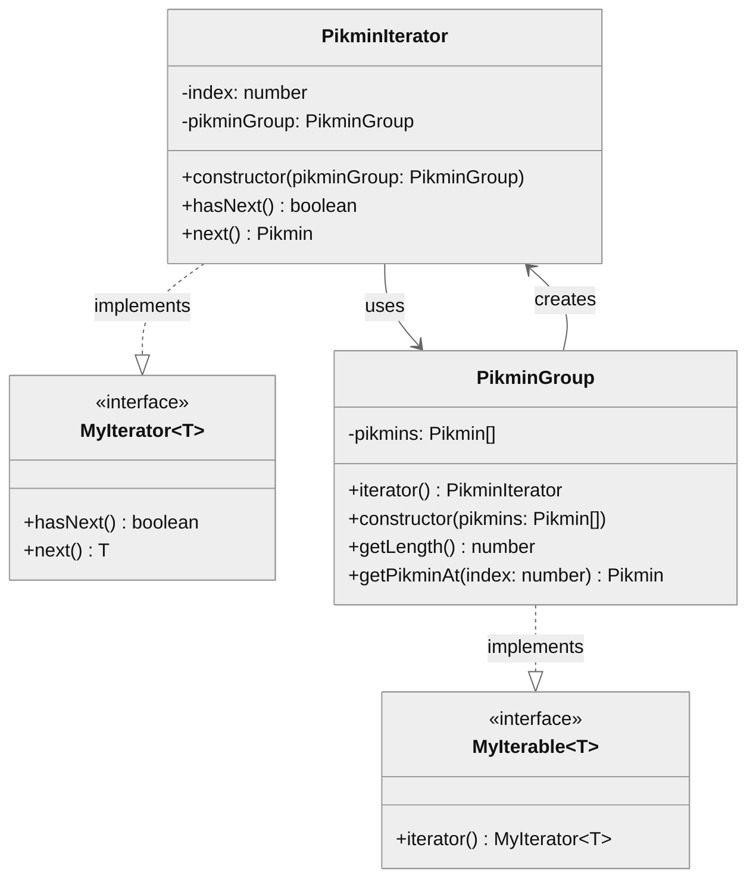

この記事は[Java言語で学ぶデザインパターン](https://www.hyuki.com/dp/)を読んで学んだ内容を、TypeScriptのサンプルコードに落としこんでみた記録です。「Iterator パターン」とは何かを理解し、TypeScriptの言語仕様との関係性を把握できる内容となっています。

## Iterator パターンとは

Iterator パターンは、何らかの集合に対して**順番に繰り返して全体をスキャン**する方法を提供するデザインパターンです。[GoF（Gang of Four）](https://ja.wikipedia.org/wiki/%E3%82%AE%E3%83%A3%E3%83%B3%E3%82%B0%E3%83%BB%E3%82%AA%E3%83%96%E3%83%BB%E3%83%95%E3%82%A9%E3%83%BC_(%E6%83%85%E5%A0%B1%E5%B7%A5%E5%AD%A6))によって定義された23のデザインパターンの1つであり、TypeScriptでは言語レベルで[Iterator インターフェース](https://github.com/Microsoft/TypeScript/blob/main/src/lib/es2015.iterable.d.ts)が提供されています。

本の中で書かれていますが、コーディングにおいて繰り返し登場する「[問題・解決・結果](http://www.washi.cs.waseda.ac.jp/wp-content/uploads/2013/07/5209-sp01.pdf)」に名前を付けたデザインパターンには、それをパターンたらしめる登場人物が存在します。パターンを理解するうえでのポイントは、これらの登場人物を押さえ、関係性を明らかにすることです。

Iterator パターンでは、次のような登場人物が出てきます。

- **Iterator （反復子)**: 要素を順番にスキャンしていくインターフェース
- **ConcreteIterator （具体的な反復子）**: Iteratorインターフェースを実装するクラス
- **Aggregate （集合体）**: Iteratorを作り出すインターフェース
- **ConcreteAggregate （具体的な集合体）**: Aggregateインターフェースを実装するクラス

## 具体例: ピクミンを投げる

任天堂のゲーム「[ピクミン](https://www.nintendo.com/jp/character/pikmin/index.html)」を例に、Iterator パターンを実装してみましょう。ゲーム内ではプレイヤーが手持ちのピクミンを投げることで、物資を運んだり、敵を攻撃したりできます。ここでは、手持ちのピクミンを先頭から順番に投げる処理を実装します。

### クラス図

登場人物をクラス図にすると、次のような関係になります。`MyIterator` インターフェースは「次の要素があるか」を判定する `hasNext` と、「次の要素を取り出す」ための `next` メソッドを定義します。
名前がややこしいのですが、`MyIterable` インターフェースがAggregateであり、集合を管理します。それを実装する `PikminGroup` はピクミンの集合を持っており、利用側はIterator経由で全体をスキャンすることができます。



### 実装コード

続いて、具体的なコードを見ていきましょう。TypeScriptでインターフェースを実装すると、次のようになります。

```ts
// Iterator
interface MyIterator<T> {
  hasNext: boolean;
  next: () => T;
}

// Aggregate
interface MyIterable<T> {
  iterator: () => MyIterator<T>;
}
```

続いて、上記のインターフェースを実装する具象クラスをつくります。ここで、ConcreteAggregateとなる `PikminGroup` が持つピクミンの型も併せて定義しましょう。

```typescript
type Pikmin = {
  color: "red" | "blue" | "yellow";
};
```

```ts
// ConcreteAggregate
class PikminGroup implements MyIterable<Pikmin> {
  // ピクミンの集合
  #pikmins: Pikmin[];
  // Iteratorを生成するメソッド
  iterator = () => new PikminIterator(this);

  constructor(pikmins: Pikmin[]) {
    this.#pikmins = pikmins;
  }

  getLength() {
    return this.#pikmins.length;
  }

  getPikminAt(index: number) {
    return this.#pikmins[index];
  }
}

// ConcreteIterator
class PikminIterator implements MyIterator<Pikmin> {
  // どこまでスキャンしたかを記録するindex
  #index: number = 0;
  // 繰り返しの対象となるConcreteAggregate
  #pikminGroup: PikminGroup;

  constructor(pikminGroup: PikminGroup) {
    this.#pikminGroup = pikminGroup;
  }

  hasNext() {
    return this.#index < this.#pikminGroup.getLength();
  }

  next() {
    if (!this.hasNext()) {
      throw new Error("There's no more Pikmin");
    }
    // indexを参照して次の要素を取得する。その後、indexをインクリメントする
    const pikmin = this.#pikminGroup.getPikminAt(this.#index);
    this.#index++;
    return pikmin;
  }
}
```

最後にピクミンを管理する `Player` クラスを実装します。`Player` は `PikminGroup` クラスを経由してIteratorを生成することで、集合を順番にスキャンすることができます。ここで注目してほしいのは、集合を処理する `throwAllPikmins` は**Iterator の提供するメソッドのみで繰り返しを実装**できていることです。

```ts
class Player {
  #pikminGroup: PikminGroup;

  constructor(pikminGroup: PikminGroup) {
    this.#pikminGroup = pikminGroup;
  }

  throwAllPikmins() {
    // Iteratorを初期化
    const iterator = this.#pikminGroup.iterator();
    // `hasNext()` で次の要素があるか判定
    if (!iterator.hasNext()) {
      console.log("Missed!");
    }
    while (iterator.hasNext()) {
      // `next()` メソッドで次の要素を取り出す
      const pikmin = iterator.next();
      console.log(`Threw a ${pikmin.color} pikmin.`);
    }
  }
}
```

実際に利用するコードを書いてみます。

```ts
const pikmins: Pikmin[] = [
  { color: "red" },
  { color: "red" },
  { color: "blue" },
  { color: "yellow" },
];
const player = new Player(new PikminGroup(pikmins));
player.throwAllPikmins();
```

実行結果は次のようになります。

```
Threw a red pikmin.
Threw a red pikmin.
Threw a blue pikmin.
Threw a yellow pikmin.
```

## Iteratorパターンが何を解決するのか

Iterator パターンは「集合に対して、順番に全体をスキャンする」という機能をインターフェースとして定義します。これにより、集合を処理したい呼び出し側のコードに影響を与えることなく、ConcreteIteratorの内部実装を変更可能になります。これを実証するために、`PikminGroup` の内部実装を `Array` から `Map` に変更してみましょう。

```diff ts
class PikminGroup implements MyIterable<Pikmin> {
-  #pikmins: Pikmin[];
+  #pikmins: Map<number, Pikmin>;
  iterator = () => new PikminIterator(this);

-  constructor(pikmins: Pikmin[]) {
+  constructor(pikmins: Map<number, Pikmin>) {
    this.#pikmins = pikmins;
  }

  getLength() {
-    return this.#pikmins.length;
+    return this.#pikmins.size;
  }

  getPikminAt(index: number) {
-    return this.#pikmins[index];
+    const pikmin = this.#pikmins.get(index);
+    if (!pikmin) {
+      throw new Error("There's no more Pikmin.");
+    }
+    return pikmin;
  }
}
```

```diff ts
-const pikmins: Pikmin[] = [
-  { color: "red" },
-  { color: "red" },
-  { color: "blue" },
-  { color: "yellow" },
-];
+const pikminMap = new Map([
+  [0, { color: "red" }],
+  [1, { color: "red" }],
+  [2, { color: "blue" }],
+  [3, { color: "yellow" }],
+] as const);
-const player = new Player(new PikminGroup(pikmins));
+const player = new Player(new PikminGroup(pikminMap));
```

重要なポイントとして、**`Player` クラスの `throwAllPikmins` メソッドはいっさい変更していません**。Aggregateの実装としては内部のデータ構造を `Array` から `Map` に変更しましたが、Iterator インターフェースを通じて要素にアクセスしているため、利用側のコードは一切影響を受けていません。

## TypeScriptとの関係

TypeScript（JavaScript）において、Iterator パターンは言語レベルで組み込まれています。そのため、自前で実装することはライブラリを提供する場合でもなければ少ないのかもしれません。しかし、パターンの考え方自体が勉強になりますし、言語の提供する構文への理解に役立ちます。

例えば、`for...of` は内部的にIteratorを使用しています。`Array` や `Map` などの組み込みオブジェクトは、`Symbol.iterator` メソッドを実装しているため、`for...of` で繰り返し処理できるという仕組みです。

```ts
const array = [1, 2, 3];
for (const item of array) {
  console.log(item); // 1, 2, 3
}

const iterator = array[Symbol.iterator]();
console.log(iterator.next()); // { value: 1, done: false }
console.log(iterator.next()); // { value: 2, done: false }
console.log(iterator.next()); // { value: 3, done: false }
console.log(iterator.next()); // { value: undefined, done: true }
```

もちろん、上記の `Symbol.iterator` メソッドを持つクラスを実装すれば、自前のAggregateをつくることもできます。

## おわりに

[Java言語で学ぶデザインパターン](https://www.hyuki.com/dp/)では、最初にIterator パターンが紹介されています。比較的シンプルなパターンであるため、デザインパターンを理解するうえで良い練習になりました。今後も興味深いパターンがあれば、TypeScriptに置き換えて紹介する記事を書こうと思います。

https://github.com/yuki-yamamura/learn-iterator-pattern