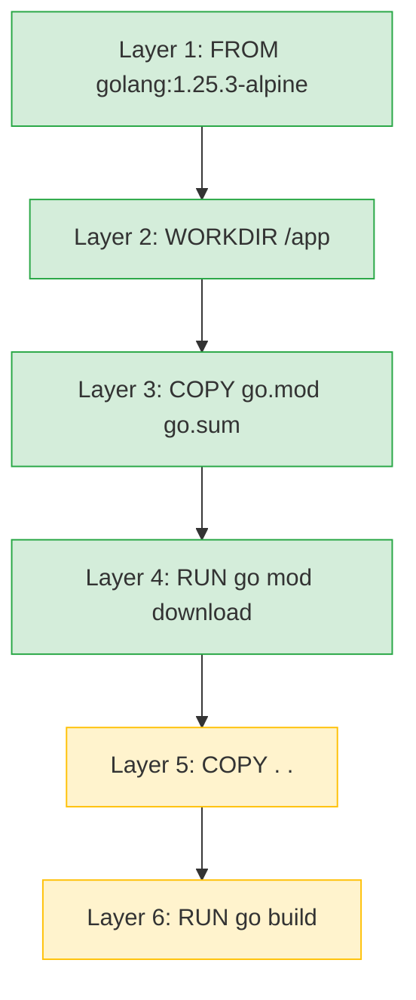

これまで Dockerfile を使う機会はあっても、自分でつくることは多くありませんでした。ベストプラクティスに関する記事を読んだことをきっかけになんとなくで書いている Dockerfile を見直したくなったので、コマンドを実行しながら学習した内容をまとめます。

以下の記事を参考にさせていただきました。

https://zenn.dev/isawa/articles/a721641613f013
https://zenn.dev/forcia_tech/articles/20210716_docker_best_practice#dockerfile%E3%82%92%E3%81%8D%E3%81%A1%E3%82%93%E3%81%A8%E6%9B%B8%E3%81%8F%E3%81%B9%E3%81%8D%E7%90%86%E7%94%B1
https://future-architect.github.io/articles/20240726a/

## 環境

個人でつくっている Go のバックエンドは [AWS Lambda のコンテナデプロイ](https://docs.aws.amazon.com/lambda/latest/dg/images-create.html#runtimes-images-lp)で動かしているので、その Dockerfile をベストプラクティスに倣ってつくり直すことを目標にします。

```
$ docker -v
Docker version 28.4.0, build d8eb465
$ go version
go version go1.25.3
```

## Dockerfile とは

Dockerfile はコンテナの元になるイメージを生成するための指示書です。以下の Dockerfile は Docker Hub で公開されている Go の公式イメージから引用[^1]したものですが、アプリケーションの実行までに必要な手続き (処理系、依存パッケージ、ビルド、起動方法) がすべて書かれていることが見て取れます。

```dockerfile
FROM golang:1.25

WORKDIR /usr/src/app

COPY go.mod go.sum ./
RUN go mod download

COPY . .
RUN go build -v -o /usr/local/bin/app ./...

CMD ["app"]
```

Docker Image の作成には `docker build` コマンド、イメージを公開するためのコンテナレジストリへのプッシュには `docker push` コマンドを使います。

```
$ docker build -t <image-name> .
$ docker push <registry-url>
```

私たちはイメージをコンテナレジストリに配置するだけでデプロイできるわけですが、AWS のようなクラウドサービスがイメージからコンテナを生成、コンテナを実行環境にデプロイするまでのプロセスをまるっと隠蔽してくれているからです。従来はレンタルサーバーに [Apache Web Server](https://httpd.apache.org/) などを使って自力でサーバーを構築していた部分が、クラウドサービスと Docker によって抽象化されたと理解しました。

Docker 全体のアーキテクチャにおける Dockerfile の立ち位置は、公式の図解[^2]がとてもわかりやすいです。


*Docker Architecture (公式ドキュメントから引用)*

## コンテナイメージに求められること

Dockerfile から生成されたイメージが実行可能なコンテナになり、指定した実行環境でアプリケーションが動作することがわかりました。よい Dockerfile を書くことは本番環境で稼働するアプリケーションに求められる要件を満たすことに直結するため、そこにベストプラクティスを適用するモチベーションが生まれます。

よいコンテナイメージが備えている特性として、[こちらの記事](https://zenn.dev/forcia_tech/articles/20210716_docker_best_practice#dockerfile%E3%82%92%E3%81%8D%E3%81%A1%E3%82%93%E3%81%A8%E6%9B%B8%E3%81%8F%E3%81%B9%E3%81%8D%E7%90%86%E7%94%B1)で紹介されていた**再現性、セキュリティ、可搬性**が参考になりました。この記事でも、これらの特性を軸にしてベストプラクティスとの関連性を整理します。

### 再現性

公式ドキュメントのベストプラクティスでも「[Docker Image は破棄・再構築しやすくする](https://docs.docker.com/build/building/best-practices/#create-ephemeral-containers)」とありますが、イメージは頻繁に更新されます。ライフサイクルを短期的なものとして設計し、脆弱性やリリース対応、開発メンバーのジョインといったイベントに対して、ボトルネックにならないようなイメージにすることが求められます。

### セキュリティ

コンテナにおいても侵入させない、侵入されたとしても被害を局所化するというスタンスは変わりません。イメージやパッケージで検出された脆弱性対応、セキュアな情報の取り扱い、必要のないツールやデータを絞る、適切な権限管理といったことが求められます。

### 可搬性

Docker はホストマシンの OS に依存しない隔離された実行環境を提供してくれます。ただ、その上で動くコンテナが重かったり、イメージのビルドやプッシュに時間が掛かると開発体験が悪化してしまいます。コンテナ外への依存を排除し、軽く取り回しやすいイメージであることが求められます。

## 信頼できる軽量なベースイメージを使う

Dockerfile の冒頭に出てくるのが[ベースイメージ](https://docs.docker.com/build/building/base-images/)です。

```dockerfile
FROM golang:1.25
```

ベースイメージはプログラミング言語や実行環境の処理系がビルトインされているものから、Debian のようにピュアな Linux 環境を提供するもの、軽量な [alpine](https://hub.docker.com/_/alpine) まで様々なものがあります。実務ではセキュリティの観点から、使用するイメージは Docker が公式に認めているものに絞り、その中から要件に応じてビルトイン、またはカスタマイズしやすいイメージを選ぶ形になると思います。


また、バージョンタグは必ず固定します。アプリのパッケージ管理などと同様ですが、`latest` タグを使用してしまうと再現性が損なわれ「なにもしてないのに壊れた」という状況になりかねません。

| 観点         | 効果                                                        |
| ------------ | ----------------------------------------------------------- |
| 再現性       | バージョンタグの固定により、同じイメージを再現できる        |
| セキュリティ | Docker 公式イメージは定期的にセキュリティパッチが適用される |
| 可搬性       | 軽量なイメージを選択することで、データ転送・デプロイが高速になる  |

## マルチステージビルドを使う

Docker は[マルチステージビルド](https://docs.docker.com/build/building/multi-stage/)という機能を提供しています。これはコンテナイメージの生成を複数のステージに分割して、最終的に生成されるイメージを最適化するのに役立ちます。私はロケットが打ち上げ後に人工衛星を切り離すようなイメージで理解しました。

以下の Dockerfile はビルド用とデプロイ用 2 つのステージに分割しています。Docker は `FROM` が複数あると、それらを別々のステージとして解釈してくれます。

```dockerfile
# ビルド用のステージ (builder と命名)
FROM golang:1.25 AS builder
WORKDIR /app

# 依存パッケージのダウンロード
COPY go.mod go.sum ./
RUN go mod download

# ソースコードをコピーしてビルド (`server` というバイナリファイルを生成)
COPY . .
RUN CGO_ENABLED=0 GOOS=linux go build -o server

# デプロイ用のステージ (後述する軽量イメージ Distroless を使用)
FROM gcr.io/distroless/static-debian12
WORKDIR /app

# ビルド用のステージからバイナリだけをコピー
COPY --from=builder /app/server .
ENTRYPOINT ["./server"]
```

Go でビルドした成果物はシングルバイナリになることもあり、デプロイ用のイメージには後述する [Distroless](https://github.com/GoogleContainerTools/distroless) という軽量なベースイメージにバイナリをコピーするだけで済んでいます。また、ビルドに使用した不要なファイルが残らず、無駄を削ぎ落としたベースイメージを使えるのでセキュリティ的にも嬉しいです。

実際に生成されたイメージサイズを比較してみると、想像していたよりも差がありました。ベースイメージのサイズ差であったり、処理系やパッケージなど不要なものが削ぎ落とされた結果なのだと思います。

```shell
$ docker image ls | grep suibachi | awk '{print $1, $NF}'
suibachi-production 37.5MB // デプロイ用のイメージ
suibachi-builder 2.14GB    // ビルド用のイメージ
```

| 観点         | 効果                                                                       |
| ------------ | -------------------------------------------------------------------------- |
| セキュリティ | ビルドツールやソースコードが最終イメージに含まれず、攻撃対象面が縮小される |
| 可搬性       | 最終イメージに必要最小限のファイルのみ含まれ、サイズが大幅に縮小される     |

## キャッシュが効きやすいレイヤー構造にする

Dockerfile で `ADD` や `COPY`、`RUN` といったコマンドを実行すると、Docker はそれら 1 つ 1 つに対してレイヤーを生成します。レイヤーごとに `docker build` 時のキャッシュが効くのですが、注意したいのはキャッシュがヒットしないとそれ以降のレイヤーがすべて再生成になってしまう点です。よって、**レイヤーは意味のある単位で変わりにくいものから順に記載していくこと**が重要です。



- 緑の部分: go.mod / go.sum が変わらなければキャッシュヒット
- 黄色の部分: ソースコード変更時に再ビルドされる

以下の Dockerfile で生成されるレイヤーは、「処理系 > パッケージ > ソースコード」の順になっているため、ソースコードが変わってもパッケージのダウンロードはスキップされます。

```dockerfile
# 処理系
FROM golang:1.25.3-alpine AS base
WORKDIR /app

# 依存パッケージのダウンロード
COPY go.mod go.sum ./
RUN go mod download

FROM base AS builder
# ソースコードコピー
COPY . .
```

```
$ docker build -t <image-name> .
[+] Building 13.8s (19/19) FINISHED                                                                docker:desktop-linux
 => [internal] load build definition from Dockerfile                                                               0.0s

...省略

 => [production 1/5] FROM docker.io/library/alpine:3.21@sha256:25109184c71bdad752c8312a8623239686a9a2071e8825f2  0.6s
 => => resolve docker.io/library/alpine:3.21@sha256:25109184c71bdad752c8312a8623239686a9a2071e8825f20acb8f2198c  0.0s
 => => sha256:d8ad8cd72600f46cc068e16c39046ebc76526e41051f43a8c249884b200936c0 4.20MB / 4.20MB                     0.5s
 => => extracting sha256:d8ad8cd72600f46cc068e16c39046ebc76526e41051f43a8c249884b200936c0                          0.1s
 => CACHED [base 2/4] WORKDIR /app                                                                                 0.0s
 => CACHED [base 3/4] COPY go.mod go.sum ./                                                                        0.0s
 => CACHED [base 4/4] RUN go mod download                                                                          0.0s
 => [builder 1/2] COPY . .                                                                                         0.1s
 => [builder 2/2] RUN CGO_ENABLED=0 GOOS=linux GOARCH=amd64 go build -o server cmd/server/main.go                  4.9s
```

| 観点   | 効果                                                                     |
| ------ | ------------------------------------------------------------------------ |
| 可搬性 | キャッシュの活用によりビルド時間が短縮され、デプロイサイクルが高速化する |

## キャッシュを意識して RUN コマンドを使う

`RUN` コマンドはレイヤーを生成するため、無駄なレイヤーができないように常に関連するコマンドはまとめた方がよいと思っていました。実際には以下の記事で紹介されている通り、ファイルを足す分にはイメージサイズに影響がなく、ファイルを削除する場合にのみ中間レイヤーにファイルが残ることでイメージサイズに差が出ます。

https://future-architect.github.io/articles/20210121/

実際にレイヤーを分割した場合、しなかった場合のイメージサイズを比較してみましたがぴったり一致しました。

```dockerfile
# test-combined (レイヤー結合する)
FROM debian:bookworm-slim
RUN apt-get update && apt-get install -y curl
```

```dockerfile
# test-split (レイヤー結合しない)
FROM debian:bookworm-slim
RUN apt-get update
RUN apt-get install -y curl
```

```
$ docker image ls | awk '{print $1, $NF}'
REPOSITORY SIZE
test-combined 194MB
test-split 194MB
```

一方で `RUN` コマンドをまとめることのデメリットもあります。適切な粒度でまとめないと、中間キャッシュが生成されなかったり、失敗時のデバッグが困難になる可能性があります。また、マルチステージビルドを前提に考えると、ビルド用のイメージサイズに拘る理由も薄いため、積極的に RUN コマンドをまとめたいケースは多くないのかもしれません。

| 観点   | 効果                                                                                              |
| ------ | ------------------------------------------------------------------------------------------------- |
| 再現性 | `RUN` コマンドを適切に分割することで中間キャッシュが有効になり、ビルドの再現性が向上する                    |
| 可搬性 | マルチステージビルドであれば `RUN` コマンドの分割がイメージサイズに影響しないため、分割のメリットが少ない。ファイルを削除する場合には有効なケースもある |

## 不要なファイルをイメージに含めない

イメージは不要なファイルやセキュアな情報を含めないようにすべきですが、そのためには[ビルドコンテキスト](https://docs.docker.com/build/concepts/context/)の理解が重要になります。以下のコマンドはカレントディレクトリ全体をビルドコンテキストとして指定しているため、Docker デーモンにカレントディレクトリ配下のすべてのファイルが読み込まれます。

```
$ docker build -t <image-name> .
```

対策として `.dockerignore` でサイズの大きいファイルや、セキュアな情報を含むファイルをビルドコンテキストから除外します。

```dockerignore
.git
.env
Dockerfile
compose.yaml
```

| 観点         | 効果                                                     |
| ------------ | -------------------------------------------------------- |
| セキュリティ | `.env` などのセキュアな情報がイメージに含まれるのを防ぐ  |
| 可搬性       | ビルドコンテキストの転送量が削減され、ビルドが高速化する |

:::details .dockerignore の効率的な管理
ビルドに必要なディレクトリやファイルが定まっているのであれば、ホワイトリスト形式で管理するのが簡単に思えたのですが、[否定マッチ](https://docs.docker.com/build/concepts/context/#negating-matches) `!` を使用するとディレクトリ全体をトラバースしてしまい逆に遅くなるケースがあるという情報がありました。

https://qiita.com/munisystem/items/b0f08b28e8cc26132212#%E5%8E%9F%E5%9B%A0

実際に試してみると `O(n)` の処理時間にはならなかったので、どこかで改善されたのかもしれません。

https://github.com/tonistiigi/fsutil/pull/121

| パターン                          | context 転送  | 合計時間 |
| --------------------------------- | ------------- | -------- |
| A: `.dockerignore` なし           | 1.97MB / 1.8s | 5.96s    |
| B: ブラックリスト    | 131B / 0.2s   | 0.85s    |
| C: ホワイトリスト | 2B / 0.0s     | 0.60s    |
:::

## デプロイには軽量でセキュアなイメージを使う

Google が開発している [Distroless](https://github.com/GoogleContainerTools/distroless) を使うことで、軽量でセキュアなイメージを簡単に作成できます。その特徴として、Debian などの Linux ベースのイメージには当然含まれるシェルが含まれていない (`docker exec` でコンテナに入れない)、依存パッケージが最小になっているという点が挙げられます。何かトラブルがあったときに詰んでしまう可能性があるので、ロギングなどのデバッグ方法は確立しておく必要がありますが、デプロイ用に適した環境を構築できる点が嬉しいです。

また、`nonroot` タグのイメージを使うことで、実行ユーザーが `root` ではなくなります。万が一コンテナに侵入された場合の被害を最小限にするため、実行ユーザーの権限は必ず確認しましょう。

| 観点         | 効果                                                                           |
| ------------ | ------------------------------------------------------------------------------ |
| セキュリティ | シェルや不要なパッケージがないため、攻撃対象面が最小化される |
| 可搬性       | 必要最小限の構成でイメージサイズが大幅に縮小される                             |

## リンターを使う

Dockerfile のリンターとしては [Hadolint](https://hadolint.com/) が有名なようですが、Docker 公式が提供している[ビルドチェック](https://docs.docker.com/build/checks/)も選択肢に入りそうです。2026 年 2 月時点ではリントルールの数が Hadolint と比べて少なく、実験的なルールもあります。ただ、Docker Desktop にビルトインされたツールである点などを考えると、取っ掛かりとしては使いやすいのかもしれないと思いました。

```
$ docker build --check .
[+] Building 0.9s (5/5) FINISHED                                                                   docker:desktop-linux
 => [internal] load build definition from Dockerfile                                                               0.0s
 => => transferring dockerfile: 732B                                                                               0.0s
 => [internal] load metadata for public.ecr.aws/awsguru/aws-lambda-adapter:0.9.1                                   0.8s
 => [internal] load metadata for docker.io/library/golang:1.25.3-alpine                                            0.9s
 => [internal] load metadata for gcr.io/distroless/static-debian12:nonroot                                         0.6s
 => [internal] load .dockerignore                                                                                  0.0s
 => => transferring context: 69B                                                                                   0.0s
Check complete, 1 warning has been found!

WARNING: JSONArgsRecommended - https://docs.docker.com/go/dockerfile/rule/json-args-recommended/
JSON arguments recommended for ENTRYPOINT to prevent unintended behavior related to OS signals
apps/backend/Dockerfile:27
--------------------
  25 |     EXPOSE 3001
  26 |     # ENTRYPOINT ["./server"]
  27 | >>> ENTRYPOINT "./server"
  28 |
--------------------
```

## おわりに

Dockerfile に関しては一通りキャッチアップできました。デプロイや環境分離、[Docker Compose](https://docs.docker.com/compose/) に関してもまだまだ学びたいことがあるので、学習を継続していきたいと思います。

[^1]: https://hub.docker.com/_/golang/#start-a-go-instance-in-your-app
[^2]: https://docs.docker.com/get-started/docker-overview/

